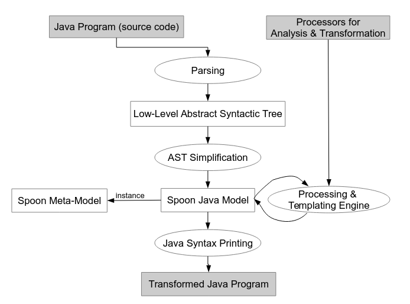
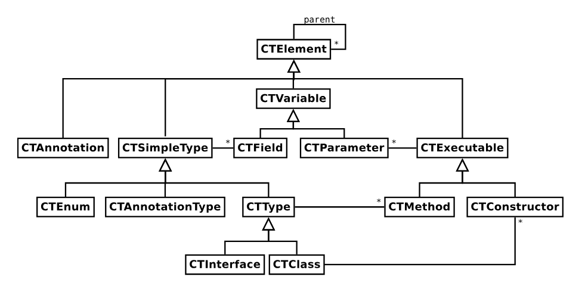

# Spoon Parsing Library

### by Luiggy Mamani Condori

## What is Spoon?

-   Spoon is a Java library that provides a powerful set of tools for analyzing and transforming Java source code at compile-time.

-   **It's based on the Launcher class, which serves as an integrated command-line** tool leveraging the JDT-based (Eclipse) builder to parse, process, and manipulate Java programs.

-   Spoon allows to analyze Java files, classes, and methods and provides the ability to search for elements like methods by signature, properties, and locations. Additionally, Spoon enables developers to build custom code analyzers by implementing its abstraction for processors (AbstractProcessor), providing flexibility and extensibility in static code analysis.

## How it works?

Spoon takes a Java program as input and converts it into an Abstract Syntax Tree (AST). It then simplifies this AST to create a more manageable model, known as the Spoon metamodel. Users can define "processors" and "templates" that transform or parse code into this model. Upon completion, the model can be translated back into source code.

#### Spoon Metamodel:

The Spoon metamodel is designed to be more accessible than the ASTs used in traditional compilers, such as javac. It is structured in three parts:

Structural: Contains the declarations of program elements, such as classes, interfaces, methods, variables, etc.
Code: Models the executable Java code (e.g., method bodies).
References: Models references to other program elements (types, methods, etc.), even if these are not part of the analyzed code (e.g., references to external libraries).

#### Code Queries:

Spoon offers a query API that allows users to efficiently search for elements in code. These queries are performed using filters, such as the TypeFilter to find mappings or the AnnotationFilter to find elements with specific annotations. Filters are applied during the AST traversal.

#### Processors:

Processors are classes that perform specific analysis on certain types of nodes in the AST (such as empty catch blocks). Spoon applies the visitor design pattern to traverse and process the nodes in the metamodel.
